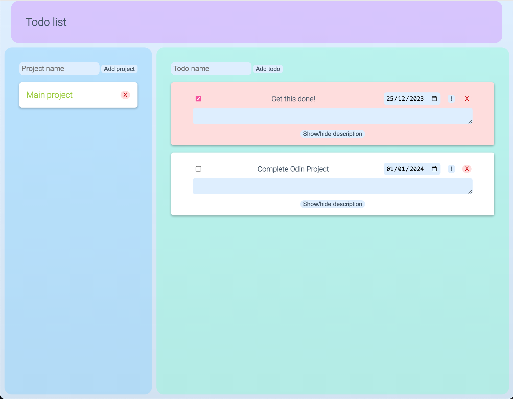

    

<h2 align="center">To-do list</h2>

  

  To get things done
  

   
  <a href="https://errantpianist.github.io/odin-todo-list/">View Demo</a>
  

 

## Preview

 

### Built With

- 
- 
- 
- 

## Features

- A to-do list implemented using pure HTML/CSS/JS
- Todos can be assigned due date and priority as well as marked complete
- Projects separate todos into groups
- Todos are saved in localStorage

 

## Outcome

- Used HTML5 **semantic elements** for better readability and structure
- Used CSS3 **grid** and **flex** to manage layout
- Used **webpack**, **NPM** and **Git** to manage project and dependencies

 

## What I learned

- Use of **Javascript** factory functions to produce todo and project objects
- Modularising code using **ES6 modules**
- Using **localStorage** to save user information

 

## Reflections

This was interesting to implement, and the complexity of the project scaled fast.

I found myself wanting to change how I implemented many of the objects after already using them in several other places. Much of the time spent was probably in changing the implementation or interface of an object, followed by fixing the cascade of other dependencies that immediately crashed. Time to learn TypeScript and TDD!

P.S. Adding localStorage at the end was really satisfying.

 

## Acknowledgments

- Thanks to [The Odin Project](https://www.theodinproject.com/) for putting together such an extensive open-source curriculum!
   

<!-- CONTACT -->

## Author

